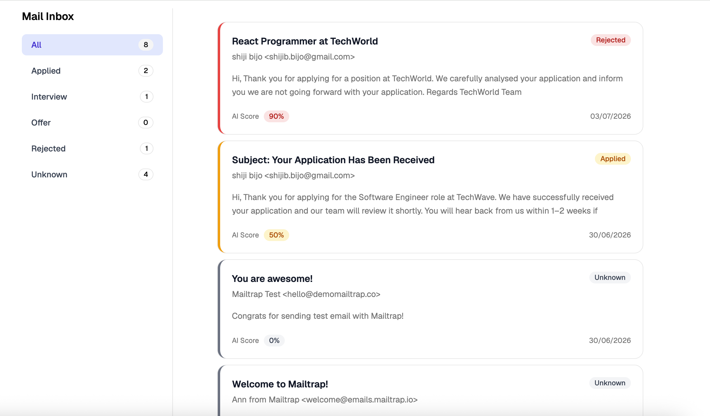
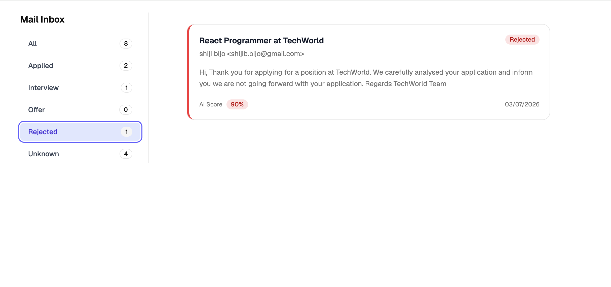

# Gmail Job Manager

> An AI-powered Gmail application that transforms raw emails into a structured job application tracker using local LLM inference with Ollama.


---

## Features

-  Gmail OAuth 2.0 authentication
-  Fetch and normalize Gmail messages
-  AI-powered job email classification
-  Confidence scoring
-  Application status detection
-  Clean, filterable inbox UI
-  Shared TypeScript domain models

---

##  Screenshots

### Inbox Dashboard

Displays AI-enriched job emails in a clean inbox interface.


---

### Email Classification

Each email is enriched with:

- Application status
- AI confidence score
- Sender
- Preview snippet



---

## System Overview

```text
                Gmail API
                    │
                    ▼
        Express Backend (TypeScript)
                    │
     Gmail Service • AI Service
                    │
          Ollama (Local LLM)
                    │
                    ▼
        Enriched Email Response
                    │
                    ▼
      React + Tailwind Frontend
```

---

##  Processing Pipeline

```text
Fetch Gmail Email
        │
        ▼
Normalize Email Data
        │
        ▼
AI Classification
        │
        ▼
Generate Structured Status
        │
        ▼
Render Inbox UI
```

---

##  Tech Stack

### Backend

- Node.js
- Express
- TypeScript
- Gmail API
- OAuth 2.0
- Ollama

### Frontend

- React
- Vite
- Tailwind CSS
- shadcn/ui
- Axios

### Monorepo

- npm Workspaces
- Shared TypeScript package

---

##  Project Structure

```text
packages/
├── client/
├── server/
└── shared/
```

---

##  Getting Started

### Backend

```bash
cd packages/server
npm install
npm run dev
```

### Frontend

```bash
cd packages/client
npm install
npm run dev
```

---

##  Why I Built This

Job application emails quickly become scattered across a busy inbox, making it difficult to track progress.

This project explores how AI can transform unstructured Gmail data into structured application insights by combining Gmail integration, local LLM inference, and a clean frontend experience.

It also served as an opportunity to practice building a full-stack TypeScript application with shared domain models, service-oriented backend architecture, and AI-powered data enrichment.

---

##  Roadmap

- ✅ Gmail OAuth
- ✅ AI classification
- ✅ Status detection
- ✅ Sidebar filtering
- ⏳ Company extraction
- ⏳ Role extraction
- ⏳ Search
- ⏳ PostgreSQL persistence
- ⏳ Analytics dashboard

---

